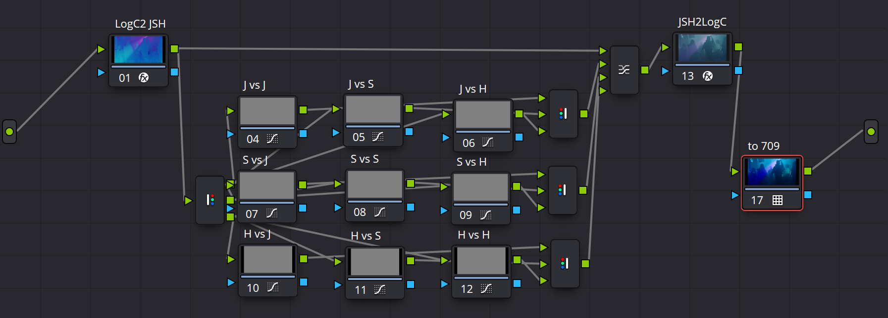
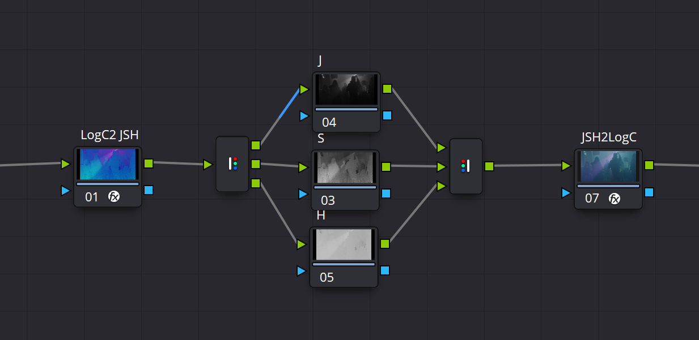

# DCTL

## AWG_To_JSH

A tool based on the ZCAM ,transfer Arri LogCv3 to JSH of ZCAM JzAzBz.

Added additional scaling of the J and S components to facilitate adjustments with the curve tool.

> Thanks to Nick-shaw who provided some of the transfer fuctions. (https://github.com/nick-shaw/aces-ot-vwg-experiments)
>
> Base on ZCAM color appearance model by Muhammad Safdar, Jon Yngve Harderberg, and Ming Ronnier Luo.

#### How To Use?

AWG_To_JSH provided a easy way for look development. Using AWGtoJSH 3x3.drx. Just like using vs curve in Resolve.

Or, you can simply split it into just the J C H channels for adjustment.

## OKLab_GHYC

    Added scaling slider for A, B components.

> Original Written by Nico Wieseneder (www.demystify-color.com)
> Original C++ code by Björn Ottosson (https://bottosson.github.io/posts/oklab/）
> Thanks a ton to Matthias Stoopman (https://www.matthiasstoopman.com/) who provided me with the Cubic Root Function (cbrtf), sourced from: https://www.delftstack.com/howto/python/python-cube-root/
>
> Adapted the direction switch from Quinn Leiho's Cone Coordinates DCTL which can be found here: (https://liftgammagain.com/forum/index.php?threads/spherical-coordinates-color-space-dctl.16898/)
>
> Thanks a lot to Jan Karow who provided me with the inset & outset idea for avoiding negative values on the blue  channel, sourced from Troy Sobotka: https://github.com/sobotka/SB2383-Configuration-Generation

## SAT_JSh

A tool based on the ZCAM for a more perceptually uniform increase or decrease in image saturation.

INPUT：Linear、CIE XYZ D65. Please using Color Space Transform, Tone mapping method:None, Gamut Mapping method:None.

Luminance Adjust：Adjusting the model's prediction of luminance. It can be adjusted to better predict the H-K Effect when there is significant spillover of color.

Saturation Suppression: Analogous to the Lift Gamma Gain color wheel, if you think of Saturation as a Gain on saturation, then Saturation Suppression is a Gamma operation on saturation. After testing, the recommended setting is 0.2 to get a comfortable result. This is equivalent to controlling the degree of "natural saturation".

> Thanks to Nick-shaw who provided some of the transfer fuctions. (https://github.com/nick-shaw/aces-ot-vwg-experiments)
>
> Base on ZCAM color appearance model by Muhammad Safdar, Jon Yngve Harderberg, and Ming Ronnier Luo.

## Testing:

### XYZtoOKLCH

### AWGtoOKLCH
